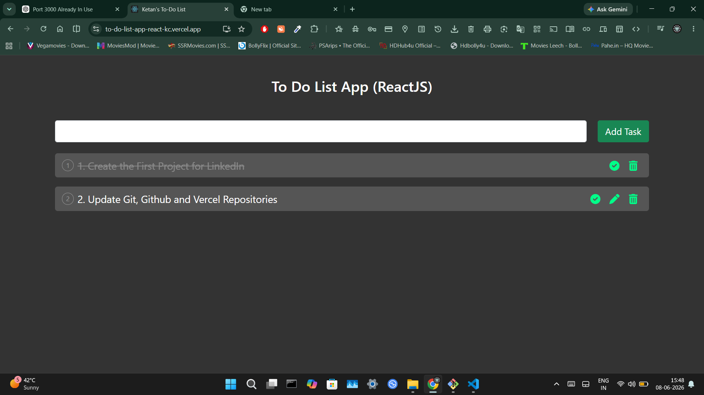

## Screenshot



# To-Do List App (ReactJS)

A simple and responsive To-Do List application built using ReactJS.

## Features

* Add new tasks
* Delete tasks
* Mark tasks as completed
* Responsive user interface
* Fast and lightweight application

## Technologies Used

* ReactJS
* JavaScript
* HTML5
* CSS3

## Live Demo

https://to-do-list-app-react-kc.vercel.app

## Installation

1. Clone the repository

```bash
git clone https://github.com/Ketan-Channa/to-do-list-app-react-kc.git
```

2. Navigate to the project directory

```bash
cd to-do-list-app-react-kc
```

3. Install dependencies

```bash
npm install
```

4. Start the development server

```bash
npm start
```

## Future Improvements

* Dark Mode
* Task Categories
* Due Dates
* Local Storage Support
* Search Functionality

## Author

Ketan Channa

GitHub: https://github.com/Ketan-Channa
